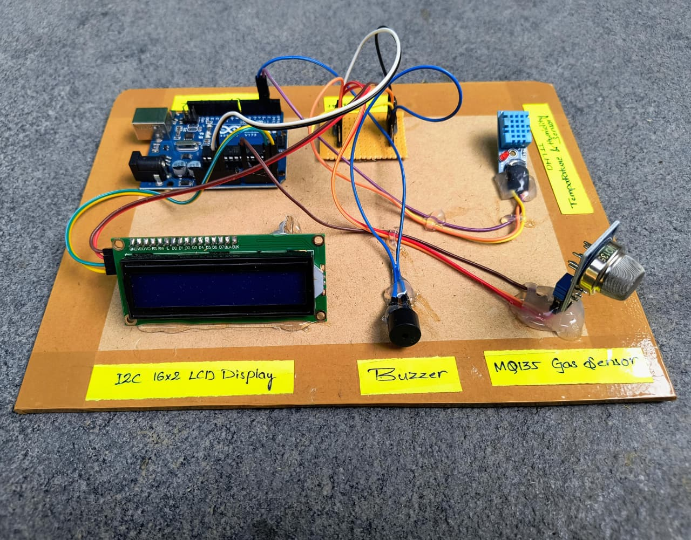

# 🌫️ Air Monitoring System with Arduino

**Air Monitoring System** is an Arduino-based embedded project designed to monitor real-time air quality, temperature, and humidity using sensors like **MQ135** and **DHT11**.  
It provides **instant alerts via buzzer** when pollution exceeds safe levels, displaying live readings on an **LCD screen** for user awareness.

---

## 📘 Project Overview

Air pollution is a growing global concern — affecting health, climate, and the environment.  
This project provides a **low-cost, real-time air quality monitoring solution** using Arduino and sensors, enabling individuals and small institutions to measure and respond to pollution locally.

The system continuously reads air quality, temperature, and humidity, and triggers **audio-visual alerts** when gas concentrations reach unsafe thresholds.

---

## 🧠 Key Features

- 🌫️ **Real-Time Air Quality Monitoring** – Detects harmful gases via MQ135 sensor.  
- 🌡️ **Environmental Sensing** – Monitors temperature and humidity using DHT11.  
- 🔔 **Buzzer Alerts** – Activates when pollution exceeds safety levels.  
- 💡 **LCD Display (I2C)** – Displays live air quality data clearly.  
- 🔋 **Low-Cost & Portable** – Compact, affordable, and easy to use.  
- ☁️ **Future-Ready** – Can be upgraded with IoT and cloud integration.

---

## ⚙️ System Architecture

**Modules Used:**
- **Arduino UNO (ATmega328P)** – Central controller for reading sensors and controlling alerts.  
- **MQ135 Gas Sensor** – Detects gases like CO₂, NH₃, SO₂, Benzene, etc.  
- **DHT11 Sensor** – Measures temperature and humidity.  
- **LCD Display (I2C)** – Displays sensor data in real time.  
- **Buzzer** – Provides alert sound when pollution crosses threshold.  
- **Power Supply (5V)** – Powers Arduino and all sensors.

**Operation Flow:**
1. MQ135 detects gas concentration.  
2. DHT11 reads temperature & humidity.  
3. Arduino processes and displays data on LCD.  
4. When gas exceeds set threshold → buzzer turns ON.  
5. System updates readings continuously.

---

## 💻 Technologies Used

| Component | Function |
|------------|-----------|
| **Arduino UNO** | Main controller for automation logic |
| **MQ135 Gas Sensor** | Detects multiple gases and pollutants |
| **DHT11 Sensor** | Measures temperature and humidity |
| **I2C LCD Display (16x2)** | Shows real-time data |
| **Buzzer** | Alerts during unsafe air quality |
| **Breadboard & Wires** | Circuit interfacing |
| **Power Supply (5V)** | Powers all components |

---

## 🧰 Hardware Connections (Quick Reference)

| **Arduino Pin** | **Connected Component / Function** |
|-----------------|------------------------------------|
| A0 | MQ135 Gas Sensor Output |
| D2 | DHT11 Sensor Data |
| A4 | LCD SDA |
| A5 | LCD SCL |
| D3 | Buzzer |
| 5V / GND | Common Power & Ground Connections |

---

## 💾 Code Overview

The Arduino sketch includes:

- **Gas Detection Logic** using MQ135 sensor  
- **Temperature & Humidity Monitoring** via DHT11 sensor  
- **LCD Display Control** using I2C communication  
- **Buzzer Alerts** for high pollution levels  
- **Calibration Routine** for accurate baseline readings  

---

## 🧩 Working Principle

1. The **MQ135 sensor** detects gases in the environment and sends analog signals to Arduino.  
2. The **DHT11 sensor** provides temperature and humidity readings.  
3. Arduino processes all data and shows the results on the **LCD display**.  
4. When the gas level exceeds the safe limit, **buzzer** gives an alert sound.  
5. System loops continuously, updating every few seconds.

---

## 📊 Results & Observations

| Condition | Gas (ppm) | Temp (°C) | Humidity (%) | Air Quality | Buzzer |
|------------|-----------|------------|---------------|--------------|--------|
| Clean Indoor Air | 200 | 25 | 50 | GOOD | OFF |
| Cooking Fumes | 400 | 27 | 55 | MODERATE | OFF |
| Near Vehicle Emissions | 600 | 30 | 60 | UNHEALTHY | ON (1 Beep) |
| Burning Area | 900 | 32 | 65 | VERY BAD | ON (2 Beeps) |
| Heavy Smoke | 1200 | 34 | 70 | TOXIC | ON (3 Beeps) |

---

## 🌍 Advantages

- Simple and low-cost design  
- Portable and energy efficient  
- Real-time data and alerts  
- Suitable for indoor/outdoor applications  
- Easy to integrate with IoT platforms  

---

## ⚠️ Limitations

- Detection range limited to ~100 cm (prototype setup)  
- Requires calibration for best accuracy  
- Not weatherproof for outdoor environments  

---

## 🚀 Future Enhancements

- ☁️ **IoT Cloud Integration** for remote monitoring  
- 📱 **Mobile App Dashboard** for real-time alerts  
- 🧠 **AI-based Pollution Prediction**  
- ☀️ **Solar Power Integration**  
- 📡 **GPS Mapping for Location Tracking**

---

## 👨‍🔧 Developed by  

**👨‍🔧 Merugumala Rabbuni**  
🎓 B.Tech in Electrical & Electronics Engineering (EEE)  
🔗 [GitHub](https://github.com/rabbunimerugumala)  
💼 [LinkedIn](https://www.linkedin.com/in/merugumala-rabbuni)

---

## 🪴 License

This project is released under the **MIT License** — free to use, modify, and distribute with proper attribution.

---

### ⭐ If you found this project helpful, consider giving it a star on GitHub!
